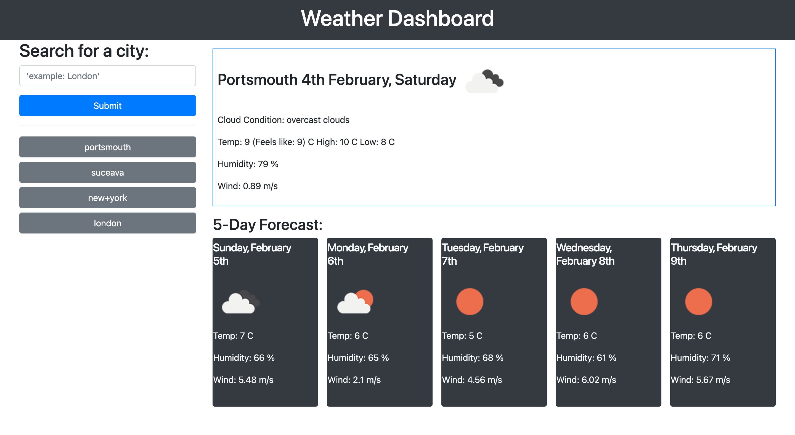

# Climate Check: A Dynamic Weather App 🌥️🌦️

We are proud to introduce our new cutting-edge Weather App, Climate Check 🌡️. With its help, you can experience the power of dynamic weather forecasting! 💪

The app detects and displays the current weather conditions of your location or a searched city, including temperature, humidity, wind speed, and more, using the OpenWeatherMap API. It is designed with a user-friendly interface and intuitive design to provide you with accurate and up-to-date weather information, making it easy for you to plan your day ahead with confidence. 🌤️🧭

## Project Link/Deployed Application 👇

* Check out the live demo [@Climate Check](https://constantin-e-t.github.io/ClimateCheck/) and start experiencing the convenience of dynamic weather forecasting today! 🚀

## Table of Contents 🔗

* [Description](#description)
* [Screenshots](#screenshots)
* [Authors](#authors)
* [Skills](#skills)
* [Stack](#stack)
* [License](#license)

## Description

* Dynamic weather app that fetches current weather data based on user's location or a entered city name
* Utilizes the OpenWeatherMap API to retrieve weather information
* The app is built with JavaScript(jQuery), Bootstrap, HTML & CSS, and is fully responsive, adapting to different screen sizes.
* User-friendly interface that allows for easy navigation and usage.
* Display the weather data on the page in a visually appealing format
* Provides an alert to the user in case of an invalid city name or a failed API request.

## Screenshots

## Authors

* [@Constantin-E-T](https://github.com/Constantin-E-T/)

## Skills

    Javascript, HTML, CSS, Python, Django

## Stack

    * JavaScript(jQuery)
    * Bootstrap
    * HTML & CSS

## License

[MIT](https://choosealicense.com/licenses/mit/)